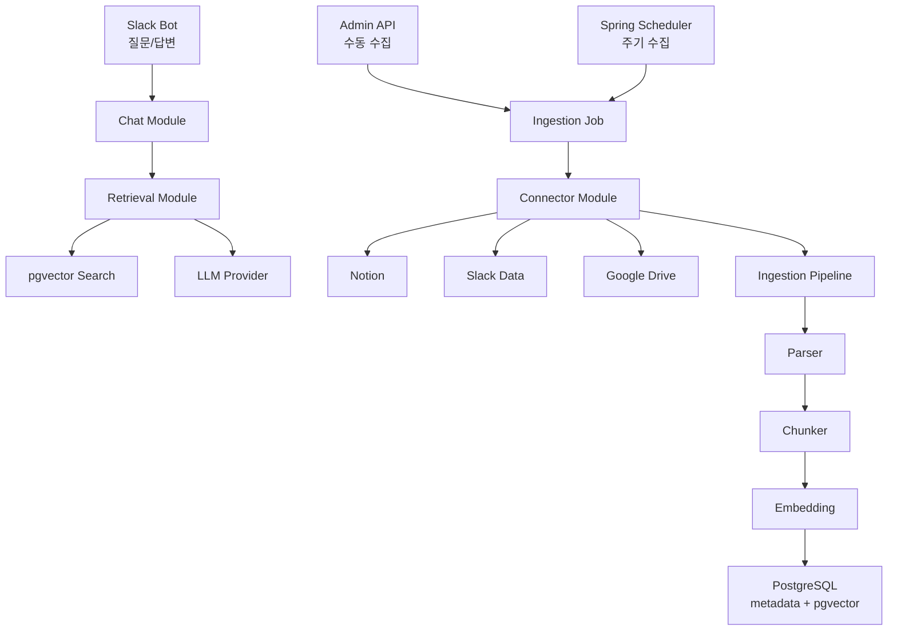
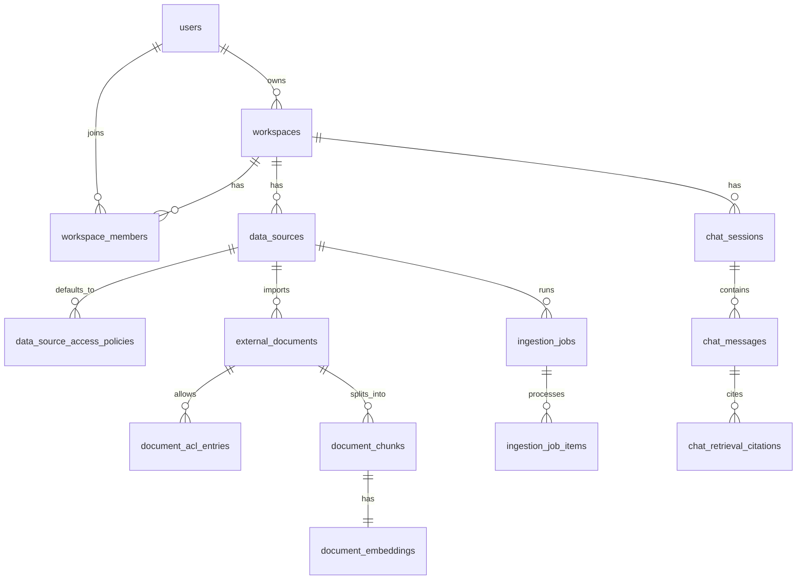
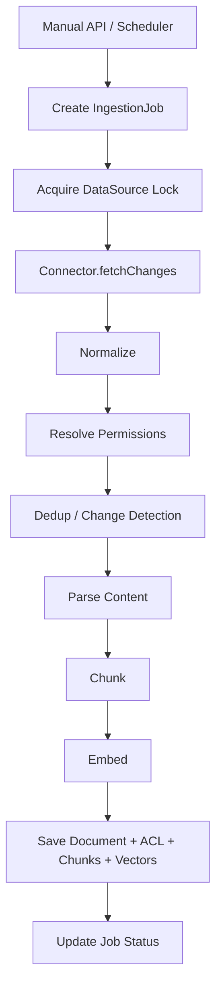
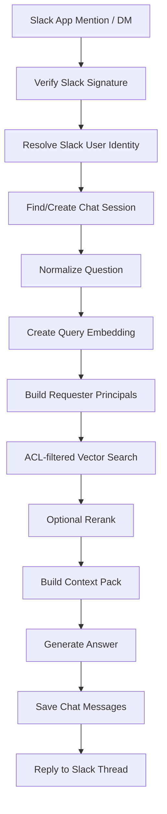

# My Data RAG 챗봇 설계

## 요약

Spring Boot 기반 애플리케이션을 만든다. 이 애플리케이션은 Notion, Slack, Google Drive에서 문서와 메시지 데이터를 수집하고, PostgreSQL과 pgvector에 검색 가능한 청크와 임베딩을 저장한다. 사용자는 Slack에서 질문하고, 시스템은 질문자의 권한으로 접근 가능한 데이터만 검색해 LLM 답변을 생성한다.

첫 버전은 1인 개인용으로 시작한다. 다만 최종 목표는 여러 사용자가 각자 권한 범위 안에서 질문하는 시스템이므로, 도메인과 DB 구조는 처음부터 멀티유저 확장이 가능해야 한다. 권한 처리는 나중에 붙이는 부가기능이 아니라, 수집과 검색의 기본 경로에 포함한다.

## 목표

- Slack을 초기 질문/답변 인터페이스로 사용한다.
- Google Drive, Notion, Slack 데이터를 수집한다.
- Teams는 초기 범위에서 제외한다.
- 수동 수집과 주기 수집을 모두 지원한다.
- 외부 출처 메타데이터, 문서 청크, 임베딩, 접근 권한을 저장한다.
- 질문 시 질문자의 권한으로 볼 수 있는 문서만 검색한다.
- 권한 필터를 통과한 청크만 LLM 컨텍스트로 전달한다.
- 첫 구현은 Spring Boot 모듈러 모놀리스로 시작하고, 이후 필요하면 수집 워커나 커넥터를 별도 서비스로 분리할 수 있게 경계를 잡는다.

## 제외 범위

- 첫 버전에서 공개 SaaS 형태로 만들지 않는다.
- 첫 버전에서 완전한 웹 관리 UI를 만들지 않는다.
- 첫 버전에서 Microsoft Teams 메시지를 색인하지 않는다.
- 모든 외부 서비스의 세부 권한 예외 케이스를 첫 버전에서 완벽히 처리하지 않는다.
- OAuth 토큰이나 API 키를 DB 평문 컬럼에 직접 저장하지 않는다.

## 추천 접근 방식

추천 구조는 모듈러 모놀리스다.

- Spring Boot 애플리케이션 1개
- PostgreSQL + pgvector DB 1개
- 내부 모듈은 `datasources`, `connectors`, `ingestion`, `documents`, `embeddings`, `retrieval`, `chat`, `slackbot`, `admin`으로 분리
- 초기 주기 수집은 Spring Scheduler 사용
- 수집 작업 상태는 DB에 저장
- 일반 도메인/메타데이터는 JPA 사용
- pgvector 검색과 임베딩 bulk 저장은 native SQL repository로 분리

이 방식은 개인용 MVP를 빠르게 만들 수 있고, 데이터량이 늘어난 뒤에도 수집 워커나 커넥터를 별도 서비스로 빼기 쉽다.

## 전체 아키텍처



## 핵심 모듈

### `datasources`

외부 데이터소스 설정을 관리한다.

책임:

- 데이터소스 등록, 수정, 상태 관리
- 데이터소스 타입, 이름, 상태, 동기화 방식, cron 표현식, sync cursor, provider별 설정 저장
- 데이터소스 기본 접근 정책 저장

### `connectors`

외부 서비스 API 연동을 담당한다.

책임:

- Google Drive, Notion, Slack 커넥터 구현
- 변경 또는 삭제된 외부 문서 조회
- 표준화된 raw document와 raw ACL entry 반환
- 문서, 청크, 임베딩을 직접 저장하지 않음

### `ingestion`

수집 작업과 수집 파이프라인 실행을 담당한다.

책임:

- 수동/주기 수집 job 생성
- 같은 데이터소스의 중복 실행 방지
- job 상태와 문서별 처리 상태 기록
- 공통 수집 파이프라인 실행
- 성공, 실패, 부분 실패 상태 반영

### `documents`

정규화된 문서와 문서 권한을 관리한다.

책임:

- 외부 문서 메타데이터 저장
- 생성, 수정, 스킵, 삭제 감지
- 문서별 ACL 저장
- 청크와 청크 메타데이터 저장

### `embeddings`

임베딩 생성을 담당한다.

책임:

- 임베딩 provider 추상화
- 임베딩 모델명과 벡터 차원 관리
- 이후 batch embedding 확장 가능하게 설계

### `retrieval`

검색을 담당한다.

책임:

- 질문 임베딩 생성
- ACL 필터가 포함된 vector search 수행
- 검색 후보와 citation 구성
- pgvector native SQL을 일반 JPA repository와 분리

### `chat`

질문 처리와 답변 생성을 담당한다.

책임:

- chat session 조회 또는 생성
- 사용자 질문 정규화
- 권한 통과 청크로 context pack 생성
- LLM 호출
- 대화 메시지와 citation 저장

### `slackbot`

Slack 연동을 담당한다.

책임:

- Slack event 수신
- Slack signature 검증
- Slack user identity 해석
- 빠른 ack 반환 후 긴 답변 처리는 비동기로 수행
- Slack thread에 답변 전송

### `admin`

개인용 관리 API를 담당한다.

책임:

- 데이터소스 생성/조회
- 수동 sync 실행
- 수집 job 조회
- 문서와 청크 디버깅 조회

## 패키지 구조

```text
com.mydata
├── MyDataApplication
├── common
│   ├── domain
│   ├── error
│   ├── json
│   └── time
├── users
├── workspaces
├── datasources
├── auth
├── connectors
│   ├── core
│   ├── notion
│   ├── slack
│   └── googledrive
├── ingestion
├── documents
├── embeddings
├── retrieval
├── chat
├── slackbot
└── admin
```

## 도메인 모델



## 권한 모델

이 시스템은 "수집 가능한 데이터"와 "답변에 사용할 수 있는 데이터"를 구분해야 한다.

수집 가능하다는 것은 애플리케이션이 provider credential을 통해 외부 문서를 가져올 수 있다는 뜻이다. 답변에 사용할 수 있다는 것은 특정 질문자가 그 문서를 읽을 권한이 있다는 뜻이다.

권한은 principal key로 표현한다.

```text
USER:{userUuid}
SLACK_USER:{slackWorkspaceId}:{slackUserId}
SLACK_WORKSPACE:{slackWorkspaceId}
SLACK_CHANNEL:{slackWorkspaceId}:{channelId}
GOOGLE_USER:{email}
WORKSPACE:{workspaceUuid}
```

### 데이터소스 기본 정책

`data_source_access_policies`는 데이터소스의 기본 읽기 권한을 저장한다.

예:

- 개인 Google Drive 데이터소스는 `USER:{ownerId}`에 기본 READ 권한을 부여한다.
- Slack public channel 데이터소스는 workspace 또는 channel principal에 READ 권한을 부여할 수 있다.
- 제한된 Notion 데이터소스는 특정 사용자 또는 그룹 principal에 READ 권한을 부여할 수 있다.

### 문서별 ACL

`document_acl_entries`는 최종 문서 단위 읽기 권한을 저장한다.

ACL entry의 출처:

- `INHERITED_FROM_DATA_SOURCE`
- `IMPORTED_FROM_PROVIDER`
- `MANUAL`

모든 retrieval query는 반드시 `document_acl_entries`를 기준으로 필터링해야 한다. 질문자의 principal과 매칭되는 ACL이 없는 문서는 LLM context로 전달하면 안 된다.

첫 1인 버전에서는 다음처럼 단순화한다.

- 내부 사용자 1명과 workspace 1개 생성
- owner의 Slack user id를 내부 사용자와 매핑
- 수집된 모든 문서에 `USER:{ownerId}` READ 권한 부여
- 그래도 검색 경로는 처음부터 ACL 필터를 통과하게 구현

## 수집 흐름

수동 수집과 주기 수집은 모두 `IngestionJob`을 만들고 같은 파이프라인을 탄다.



### 커넥터 계약

```java
public interface DataSourceConnector {
    DataSourceType supports();

    SyncCursor fetchChanges(
        DataSource dataSource,
        SyncCursor cursor,
        DocumentHandler handler
    );
}
```

커넥터는 표준화된 raw document를 반환한다.

```java
public record RawExternalDocument(
    String externalId,
    DataSourceType sourceType,
    String title,
    String uri,
    String mimeType,
    Instant externalCreatedAt,
    Instant externalUpdatedAt,
    String contentHash,
    Map<String, Object> metadata,
    RawContent content,
    List<RawAclEntry> aclEntries
) {}
```

권한 힌트도 문서와 함께 넘긴다.

```java
public record RawAclEntry(
    PrincipalType principalType,
    String externalPrincipalId,
    Permission permission,
    boolean inherited,
    String source
) {}
```

### 변경 감지

다음 신호를 사용한다.

- `data_source_id + external_id`: 같은 외부 문서인지 식별
- `external_updated_at`: 외부 수정 시각 비교
- `content_hash`: 실제 내용 변경 여부 확인

변경이 없으면 `ingestion_job_items.status = SKIPPED`로 기록한다.

### 삭제 처리

외부에서 삭제된 문서는 `external_documents.deleted_at`을 설정한다. 청크와 임베딩은 audit/debug를 위해 남겨둘 수 있지만, retrieval에서는 반드시 삭제 문서를 제외한다.

### 동시 실행 제어

같은 `data_source_id`에 대해서는 한 번에 하나의 수집 job만 실행한다. 첫 구현은 DB row lock 또는 PostgreSQL advisory lock을 사용한다. 이후 데이터량이 커지면 Redis, Kafka, 별도 worker service로 확장할 수 있다.

## Provider별 설계 메모

### Google Drive

첫 커넥터로 추천한다.

이유:

- 파일과 폴더 개념이 명확하다.
- 권한 모델이 비교적 명시적이다.
- 파일과 권한을 함께 다루는 첫 end-to-end 수집 경로로 적합하다.

동작:

- 선택된 폴더 또는 파일을 import한다.
- 파일 메타데이터, permission, modified time을 읽는다.
- 지원 파일 타입에서 텍스트를 추출한다.
- 폴더/파일 permission을 document ACL entry로 변환한다.

### Notion

동작:

- 선택된 page 또는 database를 import한다.
- Notion block content를 텍스트로 평탄화한다.
- 가능한 범위에서 provider ACL을 사용한다.
- provider ACL이 충분하지 않으면 data source policy를 적용한다.

### Slack 데이터소스

동작:

- 선택된 channel을 import한다.
- message, thread, 필요 시 첨부파일을 external document로 표현한다.
- public channel content는 workspace 또는 channel principal로 매핑할 수 있다.
- private channel content는 channel member principal로 매핑한다.
- DM과 multi-person DM 수집은 owner가 명시적으로 켜기 전까지 MVP 범위에서 제외한다.

## Retrieval과 Slack 답변 흐름



### 질문자 principal

Slack 사용자가 질문하면 다음 principal set을 만든다.

```text
USER:{internalUserId}
SLACK_USER:{slackWorkspaceId}:{slackUserId}
SLACK_WORKSPACE:{slackWorkspaceId}
SLACK_CHANNEL:{slackWorkspaceId}:{channelId}
GROUP:{groupId}
```

첫 버전에서는 대부분 `USER:{ownerId}`만 사용한다. 그래도 retrieval API는 처음부터 principal key 목록을 받게 만든다.

### ACL 필터 포함 vector search

```sql
SELECT
  c.id AS chunk_id,
  c.content,
  d.title,
  d.uri,
  d.source_type,
  e.embedding <=> CAST(:queryEmbedding AS vector) AS distance
FROM document_embeddings e
JOIN document_chunks c ON c.id = e.chunk_id
JOIN external_documents d ON d.id = c.document_id
WHERE d.workspace_id = :workspaceId
  AND d.deleted_at IS NULL
  AND EXISTS (
    SELECT 1
    FROM document_acl_entries acl
    WHERE acl.document_id = d.id
      AND acl.permission = 'READ'
      AND acl.principal_key IN (:principalKeys)
  )
ORDER BY e.embedding <=> CAST(:queryEmbedding AS vector)
LIMIT :limit;
```

### 답변 원칙

- ACL을 통과한 청크만 LLM context로 사용한다.
- 충분한 근거가 없으면 색인된 데이터에서 답을 찾지 못했다고 답한다.
- 가능한 경우 출처 제목과 URL을 citation으로 포함한다.
- 접근 권한이 없는 문서의 존재를 암시하지 않는다.
- prompt와 log에 raw credential이나 민감한 운영 정보를 포함하지 않는다.

## Admin API

초기 관리 endpoint:

```text
POST /admin/data-sources
GET  /admin/data-sources
GET  /admin/data-sources/{id}
PATCH /admin/data-sources/{id}
POST /admin/data-sources/{id}/sync

GET  /admin/ingestion-jobs
GET  /admin/ingestion-jobs/{id}

GET  /admin/documents
GET  /admin/documents/{id}
GET  /admin/documents/{id}/chunks
```

초기 Slack endpoint:

```text
POST /slack/events
POST /slack/commands/search
```

Slash command는 MVP에서 선택 사항이다. Slack Events API만으로 app mention과 DM 질문을 처리할 수 있다.

## DB 스키마 초안

확장 활성화:

```sql
CREATE EXTENSION IF NOT EXISTS vector;
CREATE EXTENSION IF NOT EXISTS pgcrypto;
```

### 사용자와 workspace

```sql
CREATE TABLE users (
    id UUID PRIMARY KEY DEFAULT gen_random_uuid(),
    email TEXT NOT NULL UNIQUE,
    display_name TEXT NOT NULL,
    created_at TIMESTAMPTZ NOT NULL DEFAULT now()
);

CREATE TABLE workspaces (
    id UUID PRIMARY KEY DEFAULT gen_random_uuid(),
    owner_user_id UUID NOT NULL REFERENCES users(id),
    name TEXT NOT NULL,
    created_at TIMESTAMPTZ NOT NULL DEFAULT now()
);

CREATE TABLE workspace_members (
    id UUID PRIMARY KEY DEFAULT gen_random_uuid(),
    workspace_id UUID NOT NULL REFERENCES workspaces(id),
    user_id UUID NOT NULL REFERENCES users(id),
    role TEXT NOT NULL,
    created_at TIMESTAMPTZ NOT NULL DEFAULT now(),
    UNIQUE (workspace_id, user_id)
);
```

### 외부 identity

```sql
CREATE TABLE external_identities (
    id UUID PRIMARY KEY DEFAULT gen_random_uuid(),
    user_id UUID REFERENCES users(id),
    workspace_id UUID NOT NULL REFERENCES workspaces(id),
    provider TEXT NOT NULL,
    external_workspace_id TEXT,
    external_user_id TEXT NOT NULL,
    email TEXT,
    display_name TEXT,
    principal_key TEXT NOT NULL,
    created_at TIMESTAMPTZ NOT NULL DEFAULT now(),
    UNIQUE (provider, external_workspace_id, external_user_id)
);
```

PostgreSQL의 unique constraint는 `NULL`을 서로 다른 값으로 취급한다. 따라서 외부 workspace id가 없는 provider는 `external_workspace_id`에 `NULL` 대신 `global` 같은 안정적인 sentinel 값을 저장한다.

### 데이터소스

```sql
CREATE TABLE data_sources (
    id UUID PRIMARY KEY DEFAULT gen_random_uuid(),
    workspace_id UUID NOT NULL REFERENCES workspaces(id),
    type TEXT NOT NULL,
    name TEXT NOT NULL,
    status TEXT NOT NULL,
    sync_mode TEXT NOT NULL,
    sync_cron TEXT,
    sync_cursor_json JSONB NOT NULL DEFAULT '{}'::jsonb,
    config_json JSONB NOT NULL DEFAULT '{}'::jsonb,
    credentials_ref TEXT,
    last_synced_at TIMESTAMPTZ,
    created_at TIMESTAMPTZ NOT NULL DEFAULT now(),
    updated_at TIMESTAMPTZ NOT NULL DEFAULT now()
);

CREATE TABLE data_source_access_policies (
    id UUID PRIMARY KEY DEFAULT gen_random_uuid(),
    data_source_id UUID NOT NULL REFERENCES data_sources(id) ON DELETE CASCADE,
    principal_key TEXT NOT NULL,
    permission TEXT NOT NULL,
    created_at TIMESTAMPTZ NOT NULL DEFAULT now(),
    UNIQUE (data_source_id, principal_key, permission)
);
```

### 문서, ACL, 청크, 임베딩

```sql
CREATE TABLE external_documents (
    id UUID PRIMARY KEY DEFAULT gen_random_uuid(),
    workspace_id UUID NOT NULL REFERENCES workspaces(id),
    data_source_id UUID NOT NULL REFERENCES data_sources(id),
    external_id TEXT NOT NULL,
    source_type TEXT NOT NULL,
    title TEXT NOT NULL,
    uri TEXT,
    mime_type TEXT,
    author TEXT,
    external_created_at TIMESTAMPTZ,
    external_updated_at TIMESTAMPTZ,
    content_hash TEXT,
    metadata_json JSONB NOT NULL DEFAULT '{}'::jsonb,
    deleted_at TIMESTAMPTZ,
    created_at TIMESTAMPTZ NOT NULL DEFAULT now(),
    updated_at TIMESTAMPTZ NOT NULL DEFAULT now(),
    UNIQUE (data_source_id, external_id)
);

CREATE TABLE document_acl_entries (
    id UUID PRIMARY KEY DEFAULT gen_random_uuid(),
    document_id UUID NOT NULL REFERENCES external_documents(id) ON DELETE CASCADE,
    principal_key TEXT NOT NULL,
    permission TEXT NOT NULL,
    source TEXT NOT NULL,
    inherited BOOLEAN NOT NULL DEFAULT false,
    synced_at TIMESTAMPTZ NOT NULL DEFAULT now(),
    UNIQUE (document_id, principal_key, permission)
);

CREATE TABLE document_chunks (
    id UUID PRIMARY KEY DEFAULT gen_random_uuid(),
    document_id UUID NOT NULL REFERENCES external_documents(id) ON DELETE CASCADE,
    chunk_index INTEGER NOT NULL,
    content TEXT NOT NULL,
    token_count INTEGER,
    metadata_json JSONB NOT NULL DEFAULT '{}'::jsonb,
    created_at TIMESTAMPTZ NOT NULL DEFAULT now(),
    UNIQUE (document_id, chunk_index)
);

CREATE TABLE document_embeddings (
    id UUID PRIMARY KEY DEFAULT gen_random_uuid(),
    chunk_id UUID NOT NULL REFERENCES document_chunks(id) ON DELETE CASCADE,
    embedding_model TEXT NOT NULL,
    embedding vector(1536) NOT NULL,
    created_at TIMESTAMPTZ NOT NULL DEFAULT now(),
    UNIQUE (chunk_id, embedding_model)
);
```

`vector(1536)`은 MVP 기본값이다. 첫 구현은 1536차원 임베딩 모델을 사용하거나, 데이터 저장 전에 첫 migration의 차원을 조정해야 한다. 운영 데이터가 생긴 뒤 임베딩 차원을 바꿔야 한다면 기존 컬럼을 직접 변경하지 말고 새 embedding model version과 backfill로 처리한다.

### 수집 job

```sql
CREATE TABLE ingestion_jobs (
    id UUID PRIMARY KEY DEFAULT gen_random_uuid(),
    workspace_id UUID NOT NULL REFERENCES workspaces(id),
    data_source_id UUID NOT NULL REFERENCES data_sources(id),
    trigger_type TEXT NOT NULL,
    status TEXT NOT NULL,
    requested_by_user_id UUID REFERENCES users(id),
    started_at TIMESTAMPTZ,
    finished_at TIMESTAMPTZ,
    error_message TEXT,
    created_at TIMESTAMPTZ NOT NULL DEFAULT now()
);

CREATE TABLE ingestion_job_items (
    id UUID PRIMARY KEY DEFAULT gen_random_uuid(),
    job_id UUID NOT NULL REFERENCES ingestion_jobs(id) ON DELETE CASCADE,
    external_id TEXT,
    document_id UUID REFERENCES external_documents(id),
    status TEXT NOT NULL,
    reason TEXT,
    processed_at TIMESTAMPTZ NOT NULL DEFAULT now()
);
```

### 채팅

```sql
CREATE TABLE chat_sessions (
    id UUID PRIMARY KEY DEFAULT gen_random_uuid(),
    workspace_id UUID NOT NULL REFERENCES workspaces(id),
    channel_type TEXT NOT NULL,
    external_channel_id TEXT,
    external_thread_id TEXT,
    created_by_user_id UUID REFERENCES users(id),
    created_at TIMESTAMPTZ NOT NULL DEFAULT now()
);

CREATE TABLE chat_messages (
    id UUID PRIMARY KEY DEFAULT gen_random_uuid(),
    session_id UUID NOT NULL REFERENCES chat_sessions(id) ON DELETE CASCADE,
    role TEXT NOT NULL,
    content TEXT NOT NULL,
    metadata_json JSONB NOT NULL DEFAULT '{}'::jsonb,
    created_at TIMESTAMPTZ NOT NULL DEFAULT now()
);

CREATE TABLE chat_retrieval_citations (
    id UUID PRIMARY KEY DEFAULT gen_random_uuid(),
    chat_message_id UUID NOT NULL REFERENCES chat_messages(id) ON DELETE CASCADE,
    chunk_id UUID NOT NULL REFERENCES document_chunks(id),
    rank INTEGER NOT NULL,
    score DOUBLE PRECISION,
    created_at TIMESTAMPTZ NOT NULL DEFAULT now()
);
```

### 인덱스

```sql
CREATE INDEX idx_data_sources_workspace ON data_sources(workspace_id);
CREATE INDEX idx_documents_workspace ON external_documents(workspace_id);
CREATE INDEX idx_documents_source_external ON external_documents(data_source_id, external_id);
CREATE INDEX idx_document_acl_principal ON document_acl_entries(principal_key);
CREATE INDEX idx_document_acl_document ON document_acl_entries(document_id);
CREATE INDEX idx_chunks_document ON document_chunks(document_id);
```

Note: IVFFlat 같은 pgvector approximate index는 대표성 있는 embedding 데이터가 쌓인 뒤 row count 기준으로 `lists`를 선택할 수 있을 때 후속 migration에서 추가한다.

## Repository 전략

JPA 사용 대상:

- users
- workspaces
- data sources
- ingestion jobs
- external documents
- document chunks
- document ACL entries
- chat sessions
- chat messages

Native SQL 사용 대상:

- pgvector similarity search
- embedding bulk upsert
- 무거운 검색/debug query

초기 retrieval repository는 다음 형태의 메서드를 제공한다.

```java
List<RetrievedChunk> searchAuthorizedChunks(
    UUID workspaceId,
    List<String> principalKeys,
    float[] queryEmbedding,
    int limit
);
```

## 트랜잭션 경계

수집은 문서 단위 트랜잭션으로 처리한다.

- job 전체를 하나의 트랜잭션으로 묶지 않는다.
- 문서 하나가 실패해도 job 전체가 실패하지 않게 한다.
- 문서 하나의 업데이트에는 문서 메타데이터, ACL, 청크, 임베딩 저장이 포함된다.
- item 처리 후 job 상태를 갱신한다.

질문 처리는 읽기 중심이다.

- Slack event endpoint는 빠르게 ack를 반환한다.
- 오래 걸리는 답변 처리는 비동기로 수행할 수 있다.
- 답변 생성 후 chat message와 citation을 저장한다.

## 오류 처리

Job status:

- `PENDING`
- `RUNNING`
- `SUCCEEDED`
- `PARTIAL_FAILED`
- `FAILED`
- `CANCELLED`

Item status:

- `CREATED`
- `UPDATED`
- `SKIPPED`
- `DELETED`
- `FAILED`

Provider rate limit 처리:

- exponential backoff
- provider `Retry-After` 지원
- 제한된 횟수의 retry
- 실패 job 재실행 가능

## 보안

필수 제어:

- Slack request signature 검증
- Slack 질문자의 identity mapping 실패 시 답변 거부
- 권한 없는 청크를 LLM에 절대 전달하지 않음
- DB row에는 `credentials_ref`만 저장
- 실제 OAuth token과 API key는 환경변수, local secret file, Vault, AWS Secrets Manager 등 secret backend에 저장
- provider access token, refresh token, 문서 원문 전체를 log에 남기지 않음
- MVP의 admin API는 admin token으로 보호
- 멀티유저 전환 전 workspace membership 검사 추가

## 설정

초기 환경변수:

```text
DATABASE_URL
SLACK_BOT_TOKEN
SLACK_SIGNING_SECRET
LLM_API_KEY
EMBEDDING_MODEL
ADMIN_API_TOKEN
```

Provider별 credential은 각 connector 구현 시 `credentials_ref` 뒤에 붙인다.

## 테스트 전략

단위 테스트:

- chunking 동작
- content hash 비교
- permission resolver 동작
- principal key 생성
- connector normalization
- retrieval context pack 생성

통합 테스트:

- PostgreSQL + pgvector 기반 Flyway migration 검증
- ACL 필터 포함 vector search
- ingestion job 상태 전이
- 문서 생성, 수정, 스킵, 삭제 처리
- native SQL repository 동작

보안 회귀 테스트:

- 권한 없는 principal은 검색 결과를 받지 못함
- ACL entry가 없는 문서는 검색되지 않음
- 삭제된 문서는 검색되지 않음
- Slack identity mapping 실패 시 답변 생성 차단
- LLM context에는 권한 통과 청크만 포함

Slack 테스트:

- signature 검증
- app mention 처리
- DM 처리
- thread reply 처리
- 긴 처리 전 빠른 ack 반환

## MVP 구현 순서

추천 첫 구현 slice:

1. Spring Boot 프로젝트 생성
2. PostgreSQL, pgvector, Flyway, JPA, validation, scheduling, Slack SDK, test dependency 추가
3. users, workspaces, data sources, documents, ACL, chunks, embeddings, ingestion jobs, chat migration 추가
4. local 개발용 owner user와 workspace seed
5. data source 생성과 manual sync job 생성을 위한 admin API 구현
6. Google Drive 첫 connector 구현
7. 제한된 파일 타입에 대한 텍스트 추출 구현
8. chunking과 embedding 저장 구현
9. ACL 필터 포함 vector search 구현
10. Slack 질문 처리와 답변 생성 구현
11. 첫 end-to-end Slack 답변 흐름이 동작한 뒤 Notion과 Slack source ingestion 추가

## 초기 구현 기본값

- LLM과 embedding 호출은 provider adapter로 감싸서 특정 vendor에 애플리케이션 코드가 직접 묶이지 않게 한다.
- 첫 migration은 1536차원 임베딩 모델을 기준으로 한다.
- MVP의 local 개발 secret은 환경변수로 관리한다.
- MVP의 scheduled ingestion은 Spring `@Scheduled` polling으로 시작한다.
- 첫 Google Drive connector slice는 plain text, Markdown, Google Docs text export, PDF text extraction을 지원한다.
- Quartz, queue system, image OCR, spreadsheet extraction, presentation extraction은 첫 end-to-end Slack 답변 흐름 이후로 미룬다.

## 인수 기준

- 데이터소스에서 import된 문서는 출처 메타데이터, 청크, 임베딩, ACL entry를 저장한다.
- 수동 sync와 주기 sync는 같은 ingestion path를 사용한다.
- 변경 없는 문서를 다시 import하면 `SKIPPED`로 기록한다.
- 삭제된 문서는 retrieval에서 제외된다.
- Slack 질문은 질문자 identity를 해석한다.
- Vector retrieval은 LLM context 생성 전에 질문자 principal key로 필터링한다.
- ACL이 매칭되지 않는 질문자는 제한 문서의 context를 받을 수 없다.
- 출처 제목 또는 URL이 있으면 답변에 citation을 포함한다.
- 수집 실패는 job과 item status로 확인할 수 있다.
