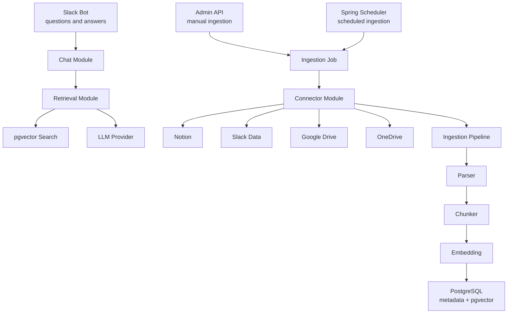
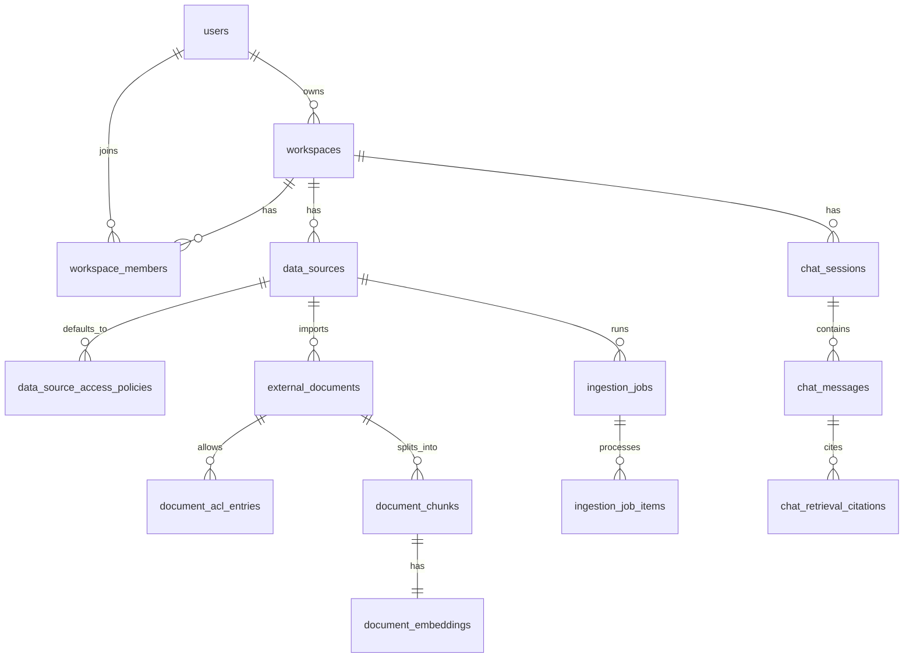
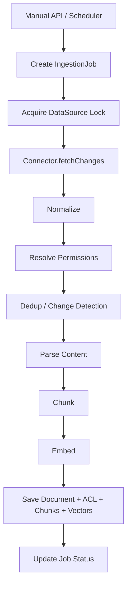
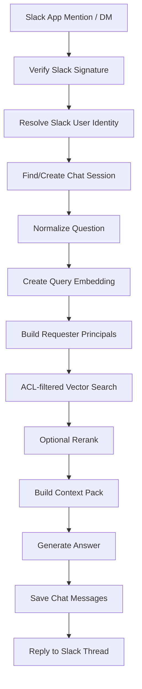

# My Data RAG Chatbot Design

## Summary

Build a Spring Boot application that collects personal and work data from external sources, stores searchable document chunks in PostgreSQL with pgvector, and answers Slack questions using only documents the requester is allowed to read.

The first version is for a single owner, but the domain and database model must support later multi-user use. Authorization is part of the ingestion and retrieval path from the start.

## Goals

- Use Slack as the initial chat interface.
- Collect data from Google Drive, Notion, Slack, and OneDrive.
- Exclude Teams for now.
- Support manual ingestion and scheduled ingestion.
- Store source metadata, document chunks, embeddings, and access rules.
- Filter retrieval by requester permissions before sending context to an LLM.
- Keep the first implementation as a modular monolith that can later split ingestion workers or connectors into separate services.

## Non-Goals

- Build a public SaaS product in the first version.
- Build a full web management UI in the first version.
- Index Microsoft Teams messages in the first version.
- Support every provider permission edge case in the first version.
- Store OAuth credentials directly in plaintext database columns.

## Recommended Approach

Use a modular monolith:

- One Spring Boot application.
- One PostgreSQL database with pgvector.
- Clear internal modules for data sources, connectors, ingestion, documents, embeddings, retrieval, chat, Slack bot, and admin APIs.
- Spring Scheduler for initial scheduled ingestion.
- Database-backed job state for observability and retry.
- Native SQL repositories for pgvector operations.
- JPA for regular domain entities and metadata.

This keeps the MVP operationally simple while preserving boundaries for future extraction of ingestion workers or connector services.

## High-Level Architecture



## Core Modules

### `datasources`

Owns configured external data sources.

Responsibilities:

- Register and update data sources.
- Store source type, name, status, sync mode, cron expression, sync cursor, and provider-specific config.
- Store default data source access policies.

### `connectors`

Owns provider-specific API calls.

Responsibilities:

- Implement connector adapters for Google Drive, Notion, Slack, and OneDrive.
- Fetch changed or deleted external documents.
- Return normalized raw documents and raw ACL entries.
- Avoid direct persistence of documents, chunks, or embeddings.

### `ingestion`

Owns ingestion jobs and orchestration.

Responsibilities:

- Create manual and scheduled ingestion jobs.
- Prevent duplicate runs for the same data source.
- Track job status and per-document processing status.
- Run the common ingestion pipeline.
- Mark jobs as succeeded, failed, or partially failed.

### `documents`

Owns normalized documents and document permissions.

Responsibilities:

- Persist external document metadata.
- Detect creates, updates, skips, and deletes.
- Store document-level ACL entries.
- Store chunks and chunk metadata.

### `embeddings`

Owns embedding generation.

Responsibilities:

- Abstract the embedding provider.
- Store model name and vector dimension assumptions.
- Support batch embedding later.

### `retrieval`

Owns search.

Responsibilities:

- Create query embeddings.
- Run ACL-filtered vector search.
- Build retrieval candidates and citations.
- Keep pgvector native SQL isolated from normal JPA repositories.

### `chat`

Owns answer generation.

Responsibilities:

- Resolve chat sessions.
- Normalize user questions.
- Build context packs from authorized chunks.
- Call the LLM.
- Save messages and citations.

### `slackbot`

Owns Slack integration.

Responsibilities:

- Receive Slack events.
- Verify Slack signatures.
- Resolve Slack user identity.
- Acknowledge quickly and process longer answers asynchronously.
- Reply in Slack threads.

### `admin`

Owns personal management APIs.

Responsibilities:

- Create and list data sources.
- Trigger manual sync.
- Inspect ingestion jobs.
- Inspect documents and chunks for debugging.

## Package Structure

```text
com.mydata
├── MyDataApplication
├── common
│   ├── domain
│   ├── error
│   ├── json
│   └── time
├── users
├── workspaces
├── datasources
├── auth
├── connectors
│   ├── core
│   ├── notion
│   ├── slack
│   ├── googledrive
│   └── onedrive
├── ingestion
├── documents
├── embeddings
├── retrieval
├── chat
├── slackbot
└── admin
```

## Domain Model



## Authorization Model

The system must distinguish between data collection and answer authorization.

Collection means the application has provider credentials that allow it to fetch a document. Answer authorization means a specific Slack requester is allowed to use that document as answer context.

Authorization is represented with principal keys:

```text
USER:{userUuid}
SLACK_USER:{slackWorkspaceId}:{slackUserId}
SLACK_WORKSPACE:{slackWorkspaceId}
SLACK_CHANNEL:{channelId}
GOOGLE_USER:{email}
MS_USER:{objectId}
MS_GROUP:{groupId}
WORKSPACE:{workspaceUuid}
```

### Data Source Policies

`data_source_access_policies` stores default read access for a source. Examples:

- A personal Google Drive source defaults to `USER:{ownerId}`.
- A Slack public channel source can default to a workspace or channel principal.
- A manually restricted Notion source can default to a specific user or group principal.

### Document ACL Entries

`document_acl_entries` stores final document-level read access. Entries can come from:

- `INHERITED_FROM_DATA_SOURCE`
- `IMPORTED_FROM_PROVIDER`
- `MANUAL`

Every retrieval query must filter by these document ACL entries. If a document has no matching ACL for the requester, it must not be used as LLM context.

For the first one-person version:

- Create one internal user and one workspace.
- Map the owner's Slack user id to the internal user.
- Grant all imported documents `READ` for `USER:{ownerId}`.
- Still execute retrieval through the ACL-filtered path.

## Ingestion Flow

Manual ingestion and scheduled ingestion both create an `IngestionJob` and use the same pipeline.



### Connector Contract

```java
public interface DataSourceConnector {
    DataSourceType supports();

    SyncCursor fetchChanges(
        DataSource dataSource,
        SyncCursor cursor,
        DocumentHandler handler
    );
}
```

Connectors emit normalized raw documents:

```java
public record RawExternalDocument(
    String externalId,
    DataSourceType sourceType,
    String title,
    String uri,
    String mimeType,
    Instant externalCreatedAt,
    Instant externalUpdatedAt,
    String contentHash,
    Map<String, Object> metadata,
    RawContent content,
    List<RawAclEntry> aclEntries
) {}
```

ACL hints are passed with the document:

```java
public record RawAclEntry(
    PrincipalType principalType,
    String externalPrincipalId,
    Permission permission,
    boolean inherited,
    String source
) {}
```

### Change Detection

Use these signals:

- `data_source_id + external_id` identifies the same external document.
- `external_updated_at` detects likely changes.
- `content_hash` detects actual content changes.

If nothing changed, record the job item as `SKIPPED`.

### Delete Handling

Deleted external documents should set `external_documents.deleted_at`. Chunks and embeddings can remain for audit/debug, but retrieval must exclude deleted documents.

### Concurrency

Only one ingestion job should run for a given `data_source_id` at a time. The first implementation can use a database row lock or PostgreSQL advisory lock. Later versions can use Redis, Kafka, or a separate worker service.

## Provider Notes

### Google Drive

Recommended first connector.

Reasons:

- File and folder concepts are clear.
- Permissions are explicit.
- OneDrive later has a similar document/permission shape.

Behavior:

- Import selected folders or files.
- Read file metadata, permissions, and modified time.
- Extract text from supported file types.
- Convert folder/file permissions into document ACL entries.

### Notion

Behavior:

- Import selected pages or databases.
- Flatten Notion block content into text.
- Use provider ACL where available.
- Fall back to data source policy when provider ACL details are insufficient.

### Slack Data Source

Behavior:

- Import selected channels.
- Represent messages, threads, and optionally attached files as external documents.
- Public channel content can map to workspace or channel principals.
- Private channel content maps to channel member principals.
- DM and multi-person DM ingestion are out of MVP scope unless explicitly enabled for the owner.

### OneDrive

Behavior:

- Use Microsoft Graph to import selected folders or files.
- Store Microsoft user/group principals.
- Teams messages remain out of scope, but OneDrive file permissions should be compatible with future Microsoft group expansion.

## Retrieval And Slack Answer Flow



### Requester Principals

When a Slack user asks a question, build a principal set for that requester:

```text
USER:{internalUserId}
SLACK_USER:{slackWorkspaceId}:{slackUserId}
SLACK_WORKSPACE:{slackWorkspaceId}
SLACK_CHANNEL:{channelId}
GROUP:{groupId}
```

The first version mostly relies on `USER:{ownerId}`, but the retrieval API should accept a list of principal keys from the beginning.

### ACL-Filtered Vector Search

```sql
SELECT
  c.id AS chunk_id,
  c.content,
  d.title,
  d.uri,
  d.source_type,
  e.embedding <=> CAST(:queryEmbedding AS vector) AS distance
FROM document_embeddings e
JOIN document_chunks c ON c.id = e.chunk_id
JOIN external_documents d ON d.id = c.document_id
WHERE d.workspace_id = :workspaceId
  AND d.deleted_at IS NULL
  AND EXISTS (
    SELECT 1
    FROM document_acl_entries acl
    WHERE acl.document_id = d.id
      AND acl.permission = 'READ'
      AND acl.principal_key IN (:principalKeys)
  )
ORDER BY e.embedding <=> CAST(:queryEmbedding AS vector)
LIMIT :limit;
```

### Answer Rules

- Use only ACL-approved chunks as LLM context.
- If no useful context is found, say that the answer cannot be found in indexed data.
- Include citations with source title and URL when available.
- Do not reveal that inaccessible documents exist.
- Do not include raw credentials or sensitive operational data in prompts or logs.

## Admin API

Initial management endpoints:

```text
POST /admin/data-sources
GET  /admin/data-sources
GET  /admin/data-sources/{id}
PATCH /admin/data-sources/{id}
POST /admin/data-sources/{id}/sync

GET  /admin/ingestion-jobs
GET  /admin/ingestion-jobs/{id}

GET  /admin/documents
GET  /admin/documents/{id}
GET  /admin/documents/{id}/chunks
```

Initial Slack endpoints:

```text
POST /slack/events
POST /slack/commands/search
```

The slash command endpoint is optional for MVP. Slack Events API is enough to support mentions and DMs.

## Database Schema Draft

Enable extensions:

```sql
CREATE EXTENSION IF NOT EXISTS vector;
CREATE EXTENSION IF NOT EXISTS pgcrypto;
```

### Users And Workspaces

```sql
CREATE TABLE users (
    id UUID PRIMARY KEY DEFAULT gen_random_uuid(),
    email TEXT NOT NULL UNIQUE,
    display_name TEXT NOT NULL,
    created_at TIMESTAMPTZ NOT NULL DEFAULT now()
);

CREATE TABLE workspaces (
    id UUID PRIMARY KEY DEFAULT gen_random_uuid(),
    owner_user_id UUID NOT NULL REFERENCES users(id),
    name TEXT NOT NULL,
    created_at TIMESTAMPTZ NOT NULL DEFAULT now()
);

CREATE TABLE workspace_members (
    id UUID PRIMARY KEY DEFAULT gen_random_uuid(),
    workspace_id UUID NOT NULL REFERENCES workspaces(id),
    user_id UUID NOT NULL REFERENCES users(id),
    role TEXT NOT NULL,
    created_at TIMESTAMPTZ NOT NULL DEFAULT now(),
    UNIQUE (workspace_id, user_id)
);
```

### External Identities

```sql
CREATE TABLE external_identities (
    id UUID PRIMARY KEY DEFAULT gen_random_uuid(),
    user_id UUID REFERENCES users(id),
    workspace_id UUID NOT NULL REFERENCES workspaces(id),
    provider TEXT NOT NULL,
    external_workspace_id TEXT,
    external_user_id TEXT NOT NULL,
    email TEXT,
    display_name TEXT,
    principal_key TEXT NOT NULL,
    created_at TIMESTAMPTZ NOT NULL DEFAULT now(),
    UNIQUE (provider, external_workspace_id, external_user_id)
);
```

Because PostgreSQL treats `NULL` values as distinct in unique constraints, connectors that do not have an external workspace id should store a stable sentinel value such as `global` instead of `NULL`.

### Data Sources

```sql
CREATE TABLE data_sources (
    id UUID PRIMARY KEY DEFAULT gen_random_uuid(),
    workspace_id UUID NOT NULL REFERENCES workspaces(id),
    type TEXT NOT NULL,
    name TEXT NOT NULL,
    status TEXT NOT NULL,
    sync_mode TEXT NOT NULL,
    sync_cron TEXT,
    sync_cursor_json JSONB NOT NULL DEFAULT '{}'::jsonb,
    config_json JSONB NOT NULL DEFAULT '{}'::jsonb,
    credentials_ref TEXT,
    last_synced_at TIMESTAMPTZ,
    created_at TIMESTAMPTZ NOT NULL DEFAULT now(),
    updated_at TIMESTAMPTZ NOT NULL DEFAULT now()
);

CREATE TABLE data_source_access_policies (
    id UUID PRIMARY KEY DEFAULT gen_random_uuid(),
    data_source_id UUID NOT NULL REFERENCES data_sources(id) ON DELETE CASCADE,
    principal_key TEXT NOT NULL,
    permission TEXT NOT NULL,
    created_at TIMESTAMPTZ NOT NULL DEFAULT now(),
    UNIQUE (data_source_id, principal_key, permission)
);
```

### Documents, ACL, Chunks, Embeddings

```sql
CREATE TABLE external_documents (
    id UUID PRIMARY KEY DEFAULT gen_random_uuid(),
    workspace_id UUID NOT NULL REFERENCES workspaces(id),
    data_source_id UUID NOT NULL REFERENCES data_sources(id),
    external_id TEXT NOT NULL,
    source_type TEXT NOT NULL,
    title TEXT NOT NULL,
    uri TEXT,
    mime_type TEXT,
    author TEXT,
    external_created_at TIMESTAMPTZ,
    external_updated_at TIMESTAMPTZ,
    content_hash TEXT,
    metadata_json JSONB NOT NULL DEFAULT '{}'::jsonb,
    deleted_at TIMESTAMPTZ,
    created_at TIMESTAMPTZ NOT NULL DEFAULT now(),
    updated_at TIMESTAMPTZ NOT NULL DEFAULT now(),
    UNIQUE (data_source_id, external_id)
);

CREATE TABLE document_acl_entries (
    id UUID PRIMARY KEY DEFAULT gen_random_uuid(),
    document_id UUID NOT NULL REFERENCES external_documents(id) ON DELETE CASCADE,
    principal_key TEXT NOT NULL,
    permission TEXT NOT NULL,
    source TEXT NOT NULL,
    inherited BOOLEAN NOT NULL DEFAULT false,
    synced_at TIMESTAMPTZ NOT NULL DEFAULT now(),
    UNIQUE (document_id, principal_key, permission)
);

CREATE TABLE document_chunks (
    id UUID PRIMARY KEY DEFAULT gen_random_uuid(),
    document_id UUID NOT NULL REFERENCES external_documents(id) ON DELETE CASCADE,
    chunk_index INTEGER NOT NULL,
    content TEXT NOT NULL,
    token_count INTEGER,
    metadata_json JSONB NOT NULL DEFAULT '{}'::jsonb,
    created_at TIMESTAMPTZ NOT NULL DEFAULT now(),
    UNIQUE (document_id, chunk_index)
);

CREATE TABLE document_embeddings (
    id UUID PRIMARY KEY DEFAULT gen_random_uuid(),
    chunk_id UUID NOT NULL REFERENCES document_chunks(id) ON DELETE CASCADE,
    embedding_model TEXT NOT NULL,
    embedding vector(1536) NOT NULL,
    created_at TIMESTAMPTZ NOT NULL DEFAULT now(),
    UNIQUE (chunk_id, embedding_model)
);
```

`vector(1536)` is the MVP default. The first implementation must use an embedding model with this dimension or adjust the first migration before any data is stored. After production data exists, changing embedding dimensions should be handled as a new embedding model version and backfill, not by mutating the existing column in place.

### Ingestion Jobs

```sql
CREATE TABLE ingestion_jobs (
    id UUID PRIMARY KEY DEFAULT gen_random_uuid(),
    workspace_id UUID NOT NULL REFERENCES workspaces(id),
    data_source_id UUID NOT NULL REFERENCES data_sources(id),
    trigger_type TEXT NOT NULL,
    status TEXT NOT NULL,
    requested_by_user_id UUID REFERENCES users(id),
    started_at TIMESTAMPTZ,
    finished_at TIMESTAMPTZ,
    error_message TEXT,
    created_at TIMESTAMPTZ NOT NULL DEFAULT now()
);

CREATE TABLE ingestion_job_items (
    id UUID PRIMARY KEY DEFAULT gen_random_uuid(),
    job_id UUID NOT NULL REFERENCES ingestion_jobs(id) ON DELETE CASCADE,
    external_id TEXT,
    document_id UUID REFERENCES external_documents(id),
    status TEXT NOT NULL,
    reason TEXT,
    processed_at TIMESTAMPTZ NOT NULL DEFAULT now()
);
```

### Chat

```sql
CREATE TABLE chat_sessions (
    id UUID PRIMARY KEY DEFAULT gen_random_uuid(),
    workspace_id UUID NOT NULL REFERENCES workspaces(id),
    channel_type TEXT NOT NULL,
    external_channel_id TEXT,
    external_thread_id TEXT,
    created_by_user_id UUID REFERENCES users(id),
    created_at TIMESTAMPTZ NOT NULL DEFAULT now()
);

CREATE TABLE chat_messages (
    id UUID PRIMARY KEY DEFAULT gen_random_uuid(),
    session_id UUID NOT NULL REFERENCES chat_sessions(id) ON DELETE CASCADE,
    role TEXT NOT NULL,
    content TEXT NOT NULL,
    metadata_json JSONB NOT NULL DEFAULT '{}'::jsonb,
    created_at TIMESTAMPTZ NOT NULL DEFAULT now()
);

CREATE TABLE chat_retrieval_citations (
    id UUID PRIMARY KEY DEFAULT gen_random_uuid(),
    chat_message_id UUID NOT NULL REFERENCES chat_messages(id) ON DELETE CASCADE,
    chunk_id UUID NOT NULL REFERENCES document_chunks(id),
    rank INTEGER NOT NULL,
    score DOUBLE PRECISION,
    created_at TIMESTAMPTZ NOT NULL DEFAULT now()
);
```

### Indexes

```sql
CREATE INDEX idx_data_sources_workspace ON data_sources(workspace_id);
CREATE INDEX idx_documents_workspace ON external_documents(workspace_id);
CREATE INDEX idx_documents_source_external ON external_documents(data_source_id, external_id);
CREATE INDEX idx_document_acl_principal ON document_acl_entries(principal_key);
CREATE INDEX idx_document_acl_document ON document_acl_entries(document_id);
CREATE INDEX idx_chunks_document ON document_chunks(document_id);

CREATE INDEX idx_embeddings_vector
ON document_embeddings
USING ivfflat (embedding vector_cosine_ops)
WITH (lists = 100);
```

## Repository Strategy

Use JPA for:

- users
- workspaces
- data sources
- ingestion jobs
- external documents
- document chunks
- document ACL entries
- chat sessions
- chat messages

Use native SQL for:

- pgvector similarity search
- bulk upsert of embeddings
- heavy debug search queries

The initial retrieval repository should expose a method similar to:

```java
List<RetrievedChunk> searchAuthorizedChunks(
    UUID workspaceId,
    List<String> principalKeys,
    float[] queryEmbedding,
    int limit
);
```

## Transaction Boundaries

Ingestion should use document-level transactions:

- A whole ingestion job is not one transaction.
- One failed document should not fail the whole job.
- Each document update includes document metadata, ACL entries, chunks, and embeddings.
- The job state is updated after item processing.

Question answering is read-heavy:

- Slack event endpoint acknowledges quickly.
- Longer processing can run asynchronously.
- Chat messages and citations are saved after answer generation.

## Error Handling

Job status values:

- `PENDING`
- `RUNNING`
- `SUCCEEDED`
- `PARTIAL_FAILED`
- `FAILED`
- `CANCELLED`

Item status values:

- `CREATED`
- `UPDATED`
- `SKIPPED`
- `DELETED`
- `FAILED`

Provider rate limits should use:

- Exponential backoff.
- Provider `Retry-After` support.
- Bounded retries.
- Re-runnable failed jobs.

## Security

Required controls:

- Verify Slack request signatures.
- Reject Slack questions when identity mapping fails.
- Never send unauthorized chunks to the LLM.
- Store only `credentials_ref` in database rows.
- Keep actual OAuth tokens and API keys in environment variables, local secret files, Vault, AWS Secrets Manager, or another secret backend.
- Do not log provider access tokens, refresh tokens, or full document content.
- Protect admin APIs with an admin token in MVP.
- Add workspace membership checks before multi-user rollout.

## Configuration

Initial environment variables:

```text
DATABASE_URL
SLACK_BOT_TOKEN
SLACK_SIGNING_SECRET
LLM_API_KEY
EMBEDDING_MODEL
ADMIN_API_TOKEN
```

Provider-specific credentials can be added behind `credentials_ref` as each connector is implemented.

## Testing Strategy

Unit tests:

- Chunking behavior.
- Content hash comparison.
- Permission resolver behavior.
- Principal key creation.
- Connector normalization.
- Retrieval context pack creation.

Integration tests:

- Flyway migrations against PostgreSQL with pgvector.
- ACL-filtered vector search.
- Ingestion job state transitions.
- Document create, update, skip, delete behavior.
- Native SQL repository behavior.

Security regression tests:

- Unauthorized principals receive no search results.
- Documents without ACL entries are not searchable.
- Deleted documents are not searchable.
- Slack identity mapping failure blocks answer generation.
- LLM context contains only authorized chunks.

Slack tests:

- Signature verification.
- App mention handling.
- DM handling.
- Thread reply handling.
- Fast acknowledgement before long processing.

## MVP Slice

Recommended first implementation slice:

1. Create Spring Boot project.
2. Add PostgreSQL, pgvector, Flyway, JPA, validation, scheduling, Slack SDK, and test dependencies.
3. Add migrations for users, workspaces, data sources, documents, ACL, chunks, embeddings, ingestion jobs, and chat.
4. Seed one owner user and one workspace for local development.
5. Implement admin API for data source creation and manual sync job creation.
6. Implement Google Drive as the first connector.
7. Implement text extraction for a narrow set of file types first.
8. Implement chunking and embedding storage.
9. Implement ACL-filtered vector search.
10. Implement Slack question handling and answer generation.
11. Add Notion, Slack source ingestion, and OneDrive after the first end-to-end path works.

## Initial Implementation Defaults

- Use a provider adapter for LLM and embedding calls so the application code is not coupled to one vendor.
- Use a 1536-dimensional embedding model for the first migration.
- Use environment variables for local development secrets in the MVP.
- Use Spring `@Scheduled` polling for scheduled ingestion in the MVP.
- Support plain text, Markdown, Google Docs exported as text, and PDF text extraction in the first Google Drive connector slice.
- Defer Quartz, queue systems, image OCR, spreadsheet extraction, and presentation extraction until after the first end-to-end Slack answer flow works.

## Acceptance Criteria

- A document imported from a data source stores source metadata, chunks, embeddings, and ACL entries.
- Manual sync and scheduled sync use the same ingestion path.
- Re-importing unchanged documents records `SKIPPED`.
- Deleted documents are excluded from retrieval.
- Slack questions resolve a requester identity.
- Vector retrieval filters by requester principal keys before LLM context creation.
- A requester without matching ACL entries receives no answer context from restricted documents.
- Answers include citations when source title or URL is available.
- Ingestion failures are visible through job and item status.
